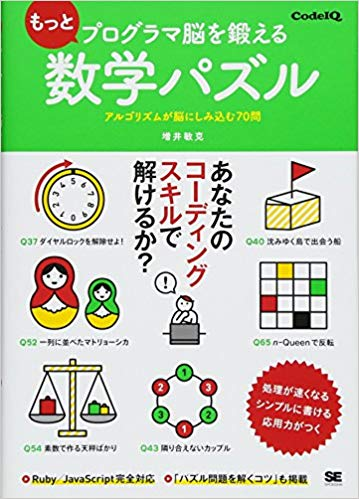

# CodeIQ_C++
원래 이 책의 일본판 원서에서는 루비와 자바스크립트로 소스 코드가 작성되어 있으나, 한국에서 번역되면서 루비 대신 파이썬3으로 대체되어 수록되어 있습니다. 
본 github 저장소에서는 C++ 을 사용하여 문제를 풀이합니다. 
해당 코드들은 저자 또는 출판사에서 공인하는 내용이 아니며, 개인이 학습적 목적으로 작성한 것임을 참고 부탁드립니다. 

The original code consists of Ruby and JavaScript, and the Korean translation book contains Python 3 and JavaScript. \
This repository provides a solution using c++. \
Please notice that these code are not an official version and are for personal learning purposes.

## 원서(Original textbook) 
[もっとプログラマ脳を鍛える数学パズル アルゴリズムが脳にしみ込む70問](https://www.amazon.co.jp/dp/4798153613) by [増井 敏克](https://twitter.com/masuipeo) 
\

## 한국 번역서(Korean translation book)
[잠자는 코딩 브레인을 깨우는 알고리즘 퍼즐 69](https://www.aladin.co.kr/shop/wproduct.aspx?ItemId=179503050) by @rintiantta
\
 
